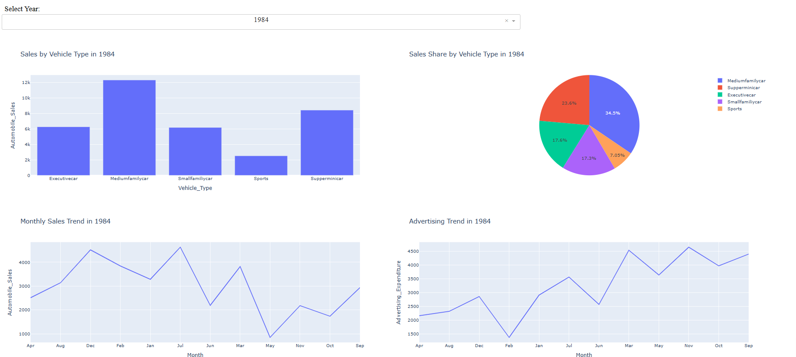
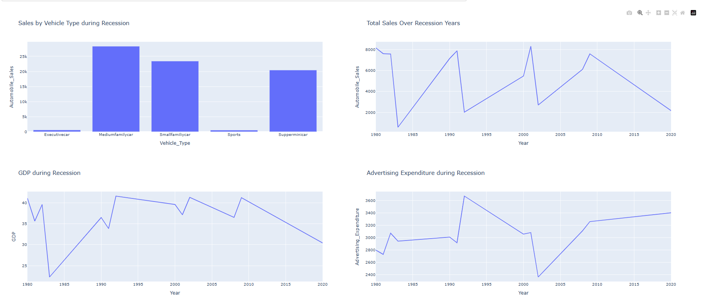
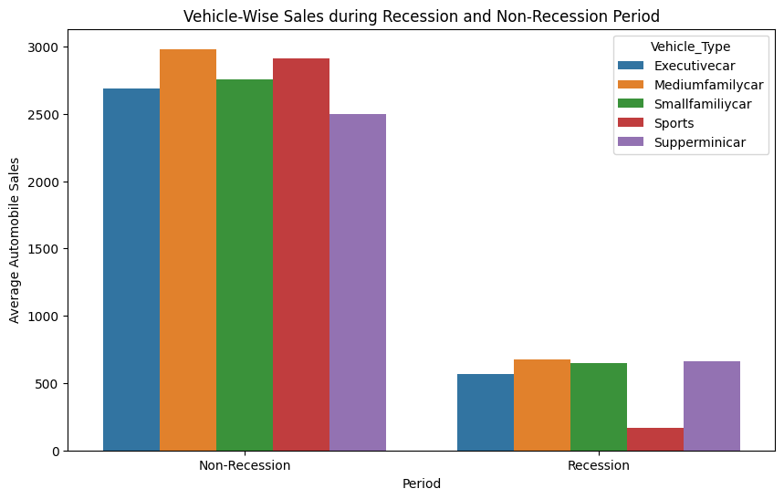
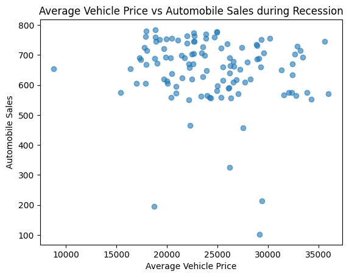
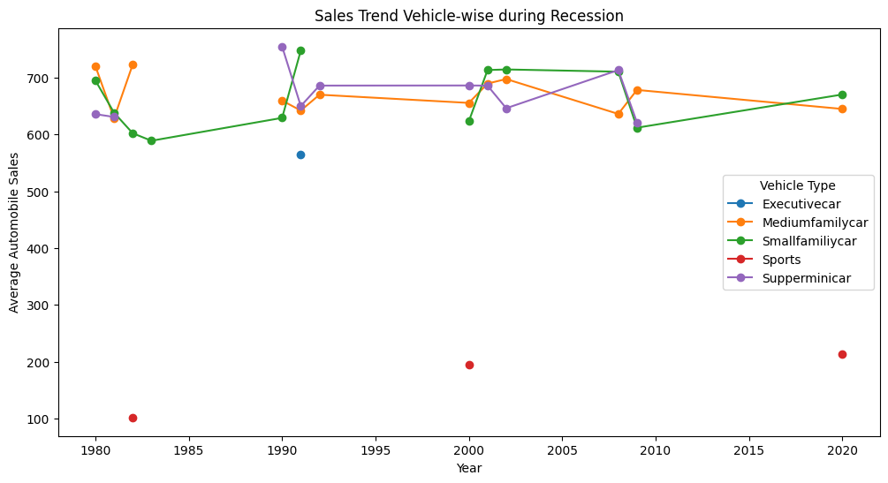

# 📊 Data Visualization Projects (IBM & Coursera)

This repository contains my work for the **Data Visualization with Python** course offered by IBM on Coursera, along with additional visualization practice projects.

The projects focus on creating interactive dashboards, statistical charts, geospatial maps, and business insights using Python visualization libraries.

---

# 📂 Repository Structure

- `DASH/` → Interactive dashboards using Plotly Dash  
- `MATPLOTLIB/` → Static plots and charts  
- `SEABORN/` → Statistical visualizations  
- `PLOTLY/` → Interactive visualizations  
- `FOLIUM/` → Map-based geospatial visualizations  
- `PROJECTS/` → End-to-end visualization projects  

---

# 📊 Projects

## 1️⃣ Analyzing Wildfire Activities in Australia

### Files
- `Analyzing wildfire activities in Australia.ipynb`
- `WildFire Activities Using Dash.py`

### Description
This project analyzes wildfire activities in Australia using interactive dashboards and visual analytics.  
It explores wildfire patterns, affected regions, and environmental trends through data visualization.

---

## 2️⃣ Historical Automobile Sales

### Files
- `Historical Automobile Sales.ipynb`
- `Historical Automobile Sales Using Dash.py`

### Description
This project visualizes historical automobile sales data using interactive dashboards and multiple chart types.  
The dashboard helps analyze recession impacts, yearly sales trends, vehicle types, and market behavior.

### Dashboard Outputs

#### 📈 Yearly Reports Dashboard

#### 📉 Recession Reports Dashboard

#### 📊 Bar Chart Visualization

#### 📌 Scatter Plot Visualization

#### 📈 Line Plot Visualization

---

# 🛠️ Technologies Used

- Python
- Pandas
- NumPy
- Matplotlib
- Seaborn
- Plotly
- Plotly Dash
- Folium
- Jupyter Notebook

---

# 🎯 Key Learning Outcomes

- Built interactive dashboards using Plotly Dash  
- Created statistical and business visualizations  
- Performed exploratory data visualization  
- Designed responsive analytical dashboards  
- Worked with geospatial visualizations using Folium  

---

# 👨‍💻 Author

**Ali Hamza**

- 📧 Email: alihamza25856@gmail.com  
- 🔗 LinkedIn: [Ali Hamza](https://www.linkedin.com/in/ali-hamza-27082a363/)
